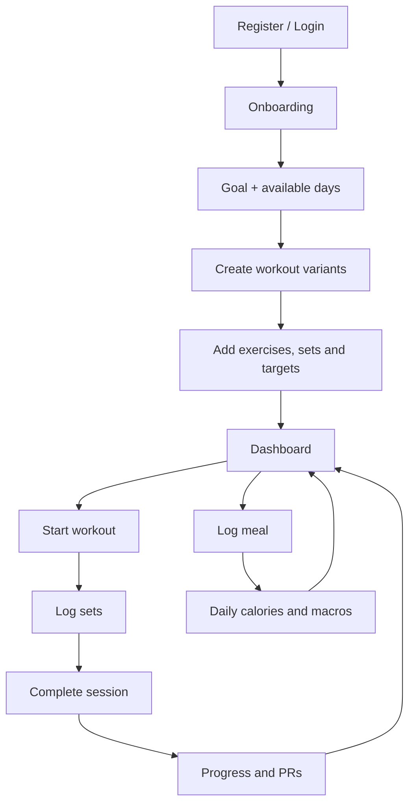

# MySelf App — 01 Product And Scope

> Product name: **MySelf App**  
> Product type: responsive web app / installable PWA  
> Frontend: React + TypeScript  
> Backend: ASP.NET Core + PostgreSQL  
> Launch language: English  
> Initial audience: healthy adults (18+) who want one clear place for workout planning, logging, nutrition and progress.
> Edition purpose: **product/engineering specification + AI-assisted .NET learning contract**. Product requirements remain the source of truth; the added learning rules control how Claude helps implement them.

> Split documentation file. Purpose: Product vision, MVP/V1 scope, core journeys, information architecture and dashboard behaviour.
> Original source: `myself-app-blueprint-v1.1-learning-r1.md`

## 1. Product vision

Το MySelf App ενώνει τρία πράγματα που σήμερα βρίσκονται συνήθως σε διαφορετικές εφαρμογές:

1. σχεδιασμό προγράμματος προπόνησης,
2. γρήγορη καταγραφή της πραγματικής προπόνησης,
3. παρακολούθηση διατροφής και σωματικού βάρους.

Η βασική υπόσχεση προς τον χρήστη είναι:

> «Ξέρω τι θα κάνω σήμερα, το καταγράφω χωρίς τριβή και βλέπω αν κινούμαι προς τον στόχο μου.»

Δεν είναι εφαρμογή ιατρικής διάγνωσης, θεραπείας ή εξατομικευμένης διαιτολογικής πράξης. Οι θερμίδες, το BMI και τα macros εμφανίζονται ως εκτιμήσεις και ο χρήστης μπορεί πάντα να τα αλλάξει.

## 2. Scope: τι φτιάχνουμε πρώτα

### MVP — απαραίτητο για την πρώτη ολοκληρωμένη έκδοση

- Register, login, logout, refresh session και reset password.
- Essential onboarding: units, age/date of birth, height, weight, calculation sex when using the estimator, activity level και goal (`Lose`, `Maintain`, `Gain`, `Track only`).
- Custom-first workout builder: ο χρήστης δημιουργεί groups/variants, ονομάζει κάθε workout και προσθέτει μόνος του exercises, sets, reps και load, χωρίς fixed weekdays.
- Κάθε workout variant έχει ασκήσεις, σειρά, optional supersets, Working/AMRAP/Drop/To-failure options, sets, reps, βάρος, optional RIR και rest timer.
- Start workout, logging ανά set, copy previous set, ολοκλήρωση session, notes.
- Add/replace exercise κατά τη διάρκεια active workout, με επιλογή today-only ή future template update.
- Offline local autosave για active workout και unfinished meal draft, με automatic sync.
- Ιστορικό workouts και βασικά personal records.
- Καταγραφή σωματικού βάρους.
- Nutrition targets: calories, protein, carbs, fat.
- Barcode scan ή manual food creation, ελεύθερη ποσότητα, meal logging, favourites και copy meal/day.
- `My Foods` και Saved Meals με scaling, per-item editing και extra foods.
- Multi-select και copy/cut/paste/duplicate/delete για workout structures και nutrition logs.
- Dashboard με κύρια έμφαση σε nutrition totals/logs, workout frequency και body-weight trend.
- Responsive mobile-first UI και βασικό dark/light theme.

### V1 — αμέσως μετά το MVP

- Full recipe builder με servings και cooked/raw weight helpers.
- Generic food search μέσω επιπλέον nutrition database.
- Distance + Duration tracking.
- Advanced substitution library και progression rules.
- Body measurements και progress photos.
- Deload tools και optional future planning.
- Data export σε CSV/JSON και account deletion.

### Later — όχι στο πρώτο build

- Coach/client accounts, social feed, challenges, AI coach.
- Wearables, Apple Health / Google Health Connect.
- Live gym discovery, payments, subscriptions.
- Native mobile εφαρμογή, microservices, event bus ή real-time infrastructure χωρίς πραγματική ανάγκη.

## 3. Core user journey



### Essential onboarding and goal branching

Το onboarding είναι σύντομο first-run setup, όχι tutorial και όχι υποχρεωτική δημιουργία ολόκληρου workout program. Ζητά μόνο όσα χρειάζονται για personalization και για μια εξηγήσιμη αρχική εκτίμηση θερμίδων.

#### Step 1 — About you

- `Unit system`: Metric / Imperial.
- `Date of birth`: η ηλικία υπολογίζεται από την ημερομηνία και δεν πληκτρολογείται ανεξάρτητα.
- `Height`.
- `Current weight`.
- `Sex used for calculation`: Male / Female, με helper `Used only by the calorie estimate formula`.
- Ο χρήστης μπορεί να επιλέξει `I prefer not to use this calculation` και να ορίσει calories/macros χειροκίνητα.
- Αν είναι κάτω των 18, το app δεν δημιουργεί calorie recommendation και συνεχίζει μόνο με workout/weight tracking και manual nutrition targets.

#### Step 2 — Your goal

- `Lose weight`.
- `Maintain weight`.
- `Gain weight` — δεν υπόσχεται ότι όλη η αύξηση θα είναι μυϊκή.
- `Track only` — δεν δημιουργεί προτεινόμενο calorie target.
- Για Lose/Gain, το `Target weight` είναι προαιρετικό στο MVP και χρησιμεύει για progress context, όχι για υπόσχεση συγκεκριμένης ημερομηνίας επίτευξης.

#### Step 3 — Activity and pace

- Επιλογή activity level με περιγραφές καθημερινής εργασίας/κίνησης και συχνότητας άσκησης, όχι μόνο ασαφείς τίτλους.
- Το app εξηγεί ότι ο χρήστης πρέπει να επιλέξει μια τυπική εβδομάδα.
- `Lose weight`: `Gentle` (`−250 kcal/day`) ή `Standard` (`−500 kcal/day`).
- `Maintain weight`: adjustment `0`.
- `Gain weight`: `Gentle` (`+150 kcal/day`) ή `Standard` (`+300 kcal/day`).
- `Track only`: μετάβαση χωρίς calculated target, με επιλογή `Set manually`.
- Οι παραπάνω τιμές είναι editable starting presets, όχι ιατρικές οδηγίες ούτε εγγυημένη ταχύτητα μεταβολής βάρους.

#### Step 4 — Review your estimate

Το result card δείχνει ξεχωριστά:

```text
Estimated BMR                 1,680 kcal/day
Activity estimate            × 1.55
Estimated maintenance        2,604 kcal/day
Goal adjustment               −500 kcal/day
Suggested daily target       2,104 kcal/day
```

Actions:

- `Use this target`.
- `Adjust target`.
- `Set manually`.
- `Back and edit answers`.
- `Skip nutrition setup`.

Το backend επιστρέφει breakdown και formula version. Το frontend δεν αναπαράγει τον calculation engine. Η αποδοχή δημιουργεί νέο effective-dated goal snapshot· δεν ξαναγράφει παλιούς nutrition logs ή προηγούμενους στόχους.

#### Step 5 — Continue into the app

Μετά την αποδοχή ή το skip, ο χρήστης μπαίνει στο dashboard. Εκεί εμφανίζονται ξεχωριστά guided actions:

- `Create your first workout program`.
- `Create your workout variants`.
- `Log your first meal`.
- `Log your weight`.

Η δημιουργία workout program δεν μπλοκάρει την ολοκλήρωση του onboarding. Δεν ζητάμε fixed workout days, επειδή ο χρήστης επιλέγει χειροκίνητα ποιο workout εκτέλεσε κάθε φορά.

### Onboarding behavior and safety rules

- Δεν υπολογίζουμε κρυφά νέο calorie target σε κάθε weight log. Μετά από ουσιαστική αλλαγή profile/activity/goal, εμφανίζουμε νέο preview και ζητάμε `Confirm new target`.
- Νέος στόχος έχει `effectiveFrom`; το ιστορικό διατηρεί τον στόχο που ίσχυε κάθε ημέρα.
- Calories από logged workout δεν προστίθενται αυτόματα στο daily calorie budget. Το activity factor έχει ήδη συμπεριλάβει μια εκτίμηση δραστηριότητας και η αυτόματη πρόσθεση θα δημιουργούσε κίνδυνο double counting.
- Το app δεν χρησιμοποιεί ρολόι ή exercise machine calories ως ακριβή άδεια για επιπλέον φαγητό στο MVP.
- Αν ο suggested target φαίνεται ακραίος ή ο χρήστης επιλέγει επιθετικό manual target, εμφανίζεται warning και προτροπή για επαγγελματική καθοδήγηση· δεν παρουσιάζεται ως ασφαλές επειδή πέρασε το validation.
- Κύηση/θηλασμός, ιστορικό διατροφικής διαταραχής, νεφρική νόσος ή clinician-managed diet δεν λαμβάνουν αυτόματη εξατομικευμένη σύσταση: manual target και μήνυμα επικοινωνίας με κατάλληλο επαγγελματία.
- Μετά από 2–4 εβδομάδες αρκετών nutrition και weight logs μπορεί να προτείνεται review του target. Καμία αλλαγή δεν εφαρμόζεται χωρίς επιβεβαίωση.

### Disclaimer copy (launch UI in English)

Compact result-screen notice:

> `This calorie target is an estimate based on the information you provided. MySelf is a tracking tool, not medical advice, and does not replace a doctor, registered dietitian, or qualified trainer. Your actual needs may differ.`

Stronger warning when the automatic flow is not appropriate:

> `MySelf cannot safely personalize this goal from these answers. Set a target provided by a qualified professional or continue without a calorie target.`

Το notice εμφανίζεται στο estimate review, παραμένει προσβάσιμο στα Nutrition Goal settings και επανεμφανίζεται όταν ο χρήστης ζητά ουσιαστικά πιο επιθετικό target. Δεν χρησιμοποιούμε checkbox που προσποιείται ιατρική συγκατάθεση· το action γράφει καθαρά `Use this estimate`.

### Flexible manual workout logging

Το app δεν προγραμματίζει και δεν προτείνει workout για συγκεκριμένη ημέρα. Το active program είναι βιβλιοθήκη από groups και variants που έχει φτιάξει ο χρήστης.

- Ο χρήστης πατά `Start workout` και επιλέγει χειροκίνητα οποιοδήποτε variant, π.χ. `Legs #2`.
- Δεν υπάρχει fixed weekday, automatic rotation ή `Suggested next workout`.
- Η ημερομηνία στο calendar προκύπτει από το πραγματικό session που ξεκίνησε/ολοκληρώθηκε, όχι από planned occurrence.
- Ο χρήστης μπορεί να αλλάξει την ημερομηνία ενός completed session και να διορθώσει ποιο variant/exercises πραγματικά εκτέλεσε.
- Μπορεί να εκτελέσει ad-hoc workout χωρίς active program.
- Δεν υπάρχει έννοια «missed planned workout» στο MVP, επειδή δεν υπάρχουν δεσμευτικά planned occurrences.

Το calendar είναι πρωτίστως **ιστορικό πραγματικής δραστηριότητας**. Επιλέγοντας ημέρα, ο χρήστης βλέπει τα completed/in-progress workouts, τα meal logs και τα weight logs της ημέρας.

## 4. Information architecture και οθόνες

### Public

- `/login`
- `/register`
- `/forgot-password`
- `/reset-password`

### Authenticated app

- `/dashboard`
- `/workouts/plan`
- `/workouts/programs`
- `/workouts/programs/:id`
- `/workouts/session/:id`
- `/workouts/history`
- `/workouts/calendar`
- `/exercises`
- `/nutrition/today`
- `/nutrition/foods`
- `/nutrition/recipes`
- `/progress`
- `/settings/profile`
- `/settings/preferences`
- `/settings/security`

### Κύρια πλοήγηση

Desktop sidebar: **Dashboard · Workouts · Nutrition · Progress · Settings**.  
Mobile bottom navigation: **Home · Workout · Log · Nutrition · Progress**. Το κεντρικό `Log` ανοίγει action sheet για workout, meal ή weight.

## 5. Dashboard

Η πρώτη οθόνη πρέπει να απαντά μέσα σε λίγα δευτερόλεπτα:

- Τι έχω καταγράψει σήμερα και πώς ξεκινώ γρήγορα κάτι νέο;
- Πώς πηγαίνω αυτή την εβδομάδα;
- Είμαι μέσα στις θερμίδες/macros;
- Βελτιώνεται η απόδοσή μου;
- Πώς κινείται το βάρος μου;

### Δομή

1. Greeting, ημερομηνία και quick actions `Log meal`, `Start workout`, `Log weight`.
2. **Nutrition today**: calories consumed/target και protein/carbs/fat progress.
3. **Workout frequency**: completed sessions αυτή την εβδομάδα/μήνα και current consistency.
4. **Body weight**: latest value και 7-day rolling trend.
5. **Start workout**: compact action που ανοίγει manual variant picker από το active program, χωρίς suggested variant.
6. Σε δεύτερη προτεραιότητα: recent exercise improvements και personal records.

Δεν εμφανίζουμε δέκα κάρτες ταυτόχρονα ούτε ένα ασαφές συνολικό fitness score. Στο mobile η σειρά είναι: nutrition today → start workout → workout frequency → body-weight trend.
