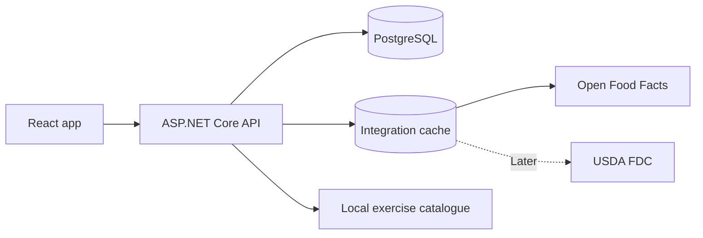

# MySelf App — 03 Nutrition And Integrations

> Split documentation file. Purpose: Nutrition calculations, food/meal flows, weight trends, external food/exercise data integrations and integration architecture.
> Original source: `myself-app-blueprint-v1.1-learning-r1.md`

## 8. Nutrition logic και υπολογισμοί

### 8.1 BMI

```text
BMI = weightKg / (heightMeters²)
```

Για ενήλικες, οι συνήθεις WHO κατηγορίες είναι `<18.5` underweight, `18.5–24.9` normal range, `25–29.9` overweight και `≥30` obesity. Το BMI είναι screening metric και δεν ξεχωρίζει μυϊκή από λιπώδη μάζα. Για ηλικίες κάτω των 18 χρειάζεται age-specific προσέγγιση, οπότε το MVP ορίζεται για 18+. Πηγή: [WHO BMI information](https://www.who.int/news-room/fact-sheets/detail/obesity-and-overweight).

### 8.2 BMR — Mifflin–St Jeor

Με βάρος σε kg, ύψος σε cm και ηλικία σε χρόνια:

```text
Men:    BMR = 10W + 6.25H − 5A + 5
Women:  BMR = 10W + 6.25H − 5A − 161
```

Η εξίσωση χρησιμοποιεί sex-specific constant για τη φυσιολογική εκτίμηση. Στο UI το πεδίο εξηγείται με σεβασμό και υπάρχει πάντα `Set calories manually`. Η αρχική δημοσίευση είναι η [Mifflin–St Jeor resting-energy equation](https://pubmed.ncbi.nlm.nih.gov/2305711/).

### 8.3 TDEE

```text
TDEE = BMR × activityFactor
```

| Activity level | Factor | UI περιγραφή |
| --- | ---: | --- |
| Sedentary | 1.20 | Καθιστική ημέρα, ελάχιστη άσκηση |
| Light | 1.375 | 1–3 προπονήσεις/εβδομάδα |
| Moderate | 1.55 | 3–5 προπονήσεις/εβδομάδα |
| Very active | 1.725 | 6–7 απαιτητικές προπονήσεις |
| Extra active | 1.90 | Πολύ απαιτητική εργασία + προπόνηση |

Οι factors είναι χονδρική αρχική εκτίμηση. Μετά από 3–4 εβδομάδες αρκετών meal και weight logs, το app μπορεί να εμφανίζει calibrated maintenance estimate, αλλά όχι στο πρώτο MVP.

### 8.4 Calorie goal

```text
maintenanceCalories = estimatedTDEE
cutCalories         = estimatedTDEE − selectedDeficit
gainCalories        = estimatedTDEE + selectedSurplus
```

Default επιλογές:

- Fat loss: ήπιο `−250 kcal/day` ή standard `−500 kcal/day`.
- Maintain: `0`.
- Muscle gain: `+150` έως `+300 kcal/day`.

Έλλειμμα περίπου 500 kcal/day χρησιμοποιείται συχνά ως αρχικό σημείο, αλλά είναι μόνο εκτίμηση και η πραγματική μεταβολή βάρους δεν είναι γραμμική. Το app δεν επιτρέπει επιθετικούς στόχους χωρίς προειδοποίηση και παραπέμπει σε επαγγελματία υγείας όπου χρειάζεται. Πηγές: [NIH/MedlinePlus guidance](https://www.nlm.nih.gov/medlineplus/ency/patientinstructions/000892.htm) και [NIDDK Body Weight Planner](https://www.niddk.nih.gov/health-information/weight-management/body-weight-planner).

Η σταδιακή απώλεια βάρους είναι πιο ρεαλιστική από την υπόσχεση γρήγορου αποτελέσματος· το CDC αναφέρει περίπου 1–2 lb την εβδομάδα ως gradual pace. Το MySelf δεν μετατρέπει αυτό το εύρος σε εγγύηση και δεν υπόσχεται target date. Πηγή: [CDC — Steps for Losing Weight](https://www.cdc.gov/healthy-weight-growth/losing-weight/index.html).

Το UI εμφανίζει πάντα `estimated`, `suggested` και `adjustment`, ποτέ `you burn exactly` ή `guaranteed loss/gain`. Οι signed adjustments εφαρμόζονται μόνο μετά το estimated TDEE και αποθηκεύονται μαζί με την έκδοση της φόρμουλας.

Στο MVP ο calorie και macro target είναι ίδιος για όλες τις ημέρες. Δεν υπάρχουν διαφορετικοί training-day/rest-day στόχοι.

### 8.5 Macros

Προτεινόμενο preset για healthy resistance-trained adults:

```text
proteinGrams = bodyWeightKg × selectedProteinFactor
fatGrams     = bodyWeightKg × selectedFatFactor
carbGrams    = (calorieTarget − proteinGrams×4 − fatGrams×9) / 4
```

- Protein default: `1.6 g/kg/day`, selectable range `1.4–2.0 g/kg/day`.
- Fat default: `0.8 g/kg/day`, με λογικό εύρος `0.6–1.0 g/kg/day`.
- Carbs: οι υπόλοιπες θερμίδες.
- Energy conversion: protein 4 kcal/g, carbs 4 kcal/g, fat 9 kcal/g.

Η ISSN αναφέρει 1.4–2.0 g/kg/day ως κατάλληλο εύρος για τους περισσότερους ασκούμενους. Αυτό αφορά υγιείς ενήλικες και δεν αντικαθιστά εξατομικευμένη συμβουλή, ειδικά σε νεφρική νόσο, εγκυμοσύνη ή διατροφική διαταραχή. Πηγή: [ISSN position stand](https://pmc.ncbi.nlm.nih.gov/articles/PMC5477153/).

### 8.6 Weight trend

- Επιτρέπονται πολλαπλές weight measurements την ίδια ημέρα και αποθηκεύονται όλες.
- Το chart χρησιμοποιεί ημερήσιο average και στη συνέχεια 7-day rolling average των ημερήσιων averages.
- Το latest value παραμένει ορατό ξεχωριστά από το trend.
- Ο χρήστης ζυγίζεται ιδανικά σε παρόμοιες συνθήκες.
- Οι αλλαγές στόχου γίνονται βάσει τάσης 2–4 εβδομάδων, όχι μιας ημέρας.
- Μελλοντική calibrated εκτίμηση μπορεί να χρησιμοποιεί average intake και weight trend, αλλά θα επισημαίνεται ως experimental.

### 8.7 Food capture flow for MVP

Ο χρήστης έχει δύο ισότιμες επιλογές:

**Scan barcode**

1. Ανοίγει camera scanner από το responsive web app.
2. Το backend αναζητά το barcode στο Open Food Facts.
3. Ο χρήστης βλέπει product name, serving basis και διαθέσιμα nutrition values.
4. Επιβεβαιώνει ή διορθώνει την ποσότητα σε grams, millilitres ή servings.
5. Το app υπολογίζει calories/macros για την πραγματική ποσότητα και αποθηκεύει snapshot.

**Create food manually**

1. Δίνει food name και προαιρετικά brand/barcode.
2. Καταχωρεί nutrition values ανά 100 g/ml ή ανά serving.
3. Επιλέγει ελεύθερη ποσότητα για το meal.
4. Μπορεί να αποθηκεύσει το food στο `My Foods` για επόμενη χρήση.

Αν ένα barcode δεν βρεθεί ή έχει ελλιπή δεδομένα, η ροή μετατρέπεται άμεσα σε manual creation με το barcode ήδη συμπληρωμένο. Generic text search σε USDA ή άλλη database μένει για μεταγενέστερη έκδοση.

### 8.8 Saved meals and reusable nutrition

Το nutrition model ξεχωρίζει τρία concepts:

- **Food**: ένα προϊόν ή ingredient, π.χ. `Chicken breast`.
- **Recipe**: ingredients που δημιουργούν ένα σύνολο με portions, π.χ. `Chicken curry — 4 servings`.
- **Saved Meal**: έτοιμος συνδυασμός foods/recipes για γρήγορη καταγραφή, π.χ. `Chicken & Rice Lunch`.

Παράδειγμα saved meal:

```text
Chicken & Rice Lunch
├── Chicken breast — 200 g
├── Basmati rice — 150 g cooked
├── Olive oil — 10 g
└── Mixed vegetables — 120 g
```

Όταν ο χρήστης προσθέτει το saved meal σε μια nutrition day:

1. Δημιουργείται ανεξάρτητο meal-log snapshot.
2. Μπορεί να αλλάξει οποιαδήποτε ποσότητα μόνο για εκείνη την ημέρα.
3. Μπορεί να αφαιρέσει items ή να προσθέσει extras χωρίς να αλλάξει το saved meal.
4. Προαιρετικό action `Update saved meal from this version` ενημερώνει το template μετά από confirmation.
5. Μπορεί να εφαρμόσει multiplier, π.χ. `0.5×`, `1×`, `1.5×`, πριν κάνει fine-tuning ανά item.

Past meal logs δεν αλλάζουν όταν ενημερώνεται ή διαγράφεται ένα Saved Meal. Η nutrition day κρατά snapshot με τα τότε foods, quantities και nutrient values.

## 9. Free/open data integrations

### Προτεινόμενη στρατηγική

| Ανάγκη | Πηγή | Κόστος / περιορισμός | Απόφαση |
| --- | --- | --- | --- |
| Manual foods | Δική μας database | Χωρίς εξωτερικό κόστος | Primary MVP flow και `My Foods` |
| Barcode / packaged foods | Open Food Facts | Open database, crowd-sourced data, attribution/license obligations | MVP barcode lookup με user confirmation |
| Generic foods και nutrients | USDA FoodData Central | Free API key, default 1,000 requests/hour/IP | Later text-search enhancement |
| Exercise catalogue | wger REST API ή curated import | Open source, exercise/ingredient entries έχουν δικό τους Creative Commons metadata | Import seed data, όχι runtime dependency |
| Custom foods/exercises | Δική μας database | Χωρίς εξωτερικό κόστος | Πάντα διαθέσιμο |

Τεκμηρίωση:

- Η [USDA FoodData Central API guide](https://fdc.nal.usda.gov/api-guide) αναφέρει δωρεάν key και default rate limit 1,000 requests/hour/IP. Το key μένει μόνο στον .NET server, ποτέ στο React bundle.
- Η [Open Food Facts API documentation](https://openfoodfacts.github.io/openfoodfacts-server/api/) εξηγεί τις ανοικτές άδειες και προειδοποιεί ότι τα δεδομένα είναι community-provided, άρα χρειάζεται validation και source label στο UI.
- Το [wger](https://wger.readthedocs.io/) παρέχει REST API και ανοικτό exercise catalogue. Η άδεια κάθε exercise/image πρέπει να αποθηκεύεται και να εμφανίζεται όπου απαιτείται.

### Integration architecture

Το frontend δεν μιλά απευθείας με τα external APIs.



Το backend:

- κρύβει keys,
- normalizes units και nutrients,
- κρατά `source`, `externalId`, `sourceVersion`, `fetchedAt`,
- κάνει short-term caching για barcode results,
- επιτρέπει στον χρήστη να διορθώσει serving και macros μόνο στο δικό του log,
- δεν αλλάζει παλιά meal logs όταν αλλάξει η εξωτερική εγγραφή.

Για exercises, η καλύτερη πρώτη επιλογή είναι να εισάγουμε 60–100 curated εγγραφές στο δικό μας schema και να επιτρέπουμε custom exercise. Αυτό κάνει το app αξιόπιστο offline/local και αποφεύγει breaking changes ή ασάφειες αδειών εικόνων.
